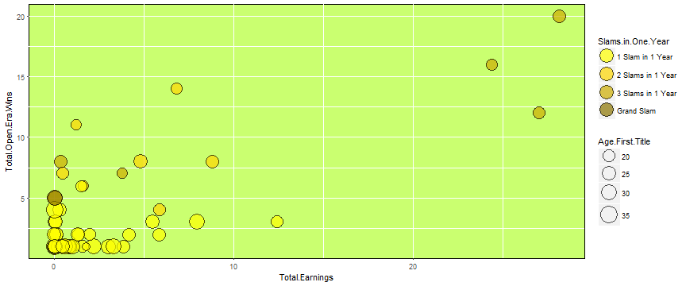

## The Open Era winners
 

This application contains an illustration of <strong>all the Grand Slam men's single champions in the Open Era</strong>.
 

The analysis includes all Grand Slam tournaments from <b>1968</b> (excluding Australian Open of the same year, who was still under the Non-Open Era) to <b>2018</b>, and it is updated up to May 3rd 2018, hence the only 2018 Grand Slam tournament taken into account is the Australian Open, played last January in Melbourne.
 

Notice that 1977 Australian Open was played twice in the same year, in January and December.

---

## Prize Money

Prize money information was mainly taken from the following link:
 
https://github.com/popovichN/grand-slam-prize-money
 
Thanks to the data gathered and made available by Nadja Popovich, and her extremely interesing article for the Guardian US:
 

<em>"Battle of the sexes: charting how women in tennis achieved equal pay"</em>, Nadja Popovich, Guardian, 11 September 2015.
 

The information for the years not included in the above file was retrieved from different Wikipedia pages, of the specific single tournament.
Data for 1969 <b>Australian Open</b> prize money were not available so an estimation has been made, based on the subsequent years and other sources.
 

All imports have been converted from Australian dollars, Britihs Pounds, French Francs and Euro to US dollars according to the Google Finance currency rates at April 20th, 2018.

---

## Grand Slam winners plot

The one below is a 'static' version of the visualization available in the Shiny app: the scatterplot displays the total earnings in US dollars (in millions of US dollars) on the x-axis and the total number of Slam tournaments won on the y-axis. The size of the points represent the age of the player at his first Slam title win and the different colors indicate the maximum number of titles won in the same year by the player.

---

## Some highlights

The only player to have ever achieved a <b>Grand Slam</b> (all 4 different tournaments in the same year) is <bigger>Rod Laver</bigger>.
 

The <b>youngest</b> player to ever win a Slam tournament was <bigger>Michael Chang</bigger>, who won the Roland Garros Open at the age of 17.
 

The player with <b>most title</b> won (12) and <b>highest earnings</b> is <bigger>Roger Federer</bigger>.
 

The only <b>African player</b> to ever won a Slam tournament is <bigger>Johan Kriek</bigger>, from South Africa.

